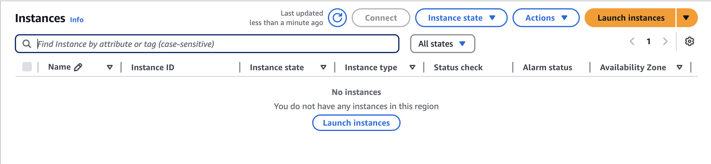
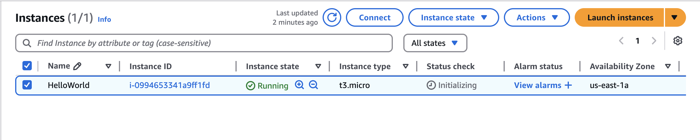
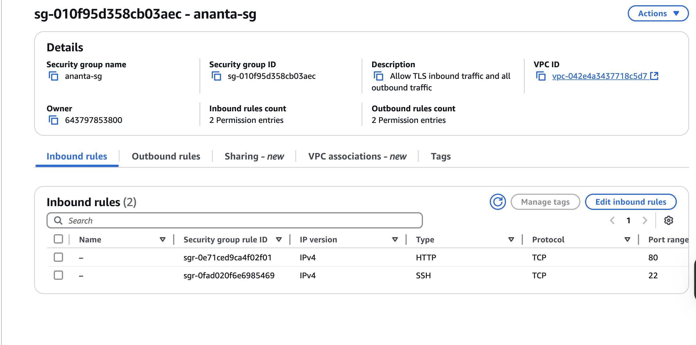
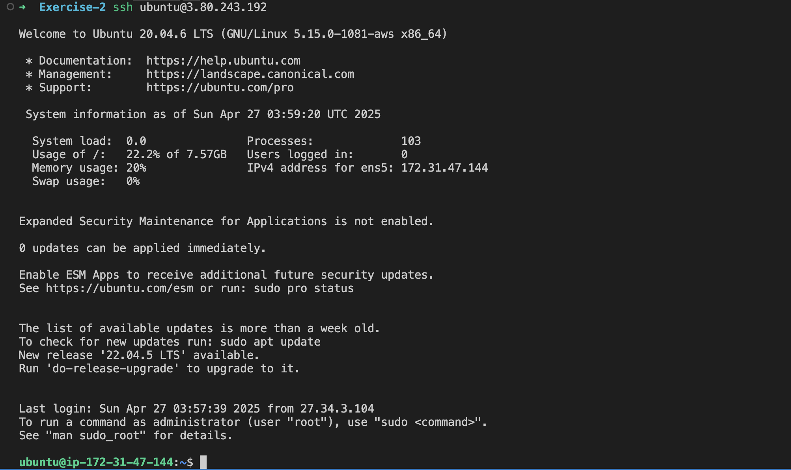

# 🚀 AWS EC2 Instance Deployment with Terraform

This project uses Terraform to deploy a simple EC2 instance in AWS with basic configuration like instance type, key pair, security group, and tags.

---

## 📚 Overview

This Terraform configuration creates an EC2 instance (`t3.micro`) in the `us-east-1a` availability zone.  
It attaches a specified key pair for SSH access and a custom security group to manage inbound/outbound traffic.

---

## ⚙️ Prerequisites

- [Terraform](https://developer.hashicorp.com/terraform/downloads) v1.0 or later
- An AWS account
- AWS CLI configured with your credentials (`aws configure`)
- An existing SSH key pair in AWS (e.g., `ananta`)
- Proper permissions to create EC2 instances and security groups

---

## 🚀 Usage

1. **Clone this repository:**
   ```bash
   https://github.com/ananta-kandel/AWS-EC2-Instance-Deployment-with-Terraform
   cd your-repo-name
2. **Initialize Terraform:**
   ```bash
   terraform init
2. **Plan the deployment:**
   ```bash
   terraform plan
3. **Apply the configuration:**
   ```bash
   terraform apply
4.  **Destroy the instance when done:**
   ```bash
   terraform destroy
   ```

---

## 📤 Outputs

1. **Before Running Terraform Apply**
   


2. **After Running Terraform Apply**
 


3. **Security Rule Created**



4. **SSH to Created Instance**


